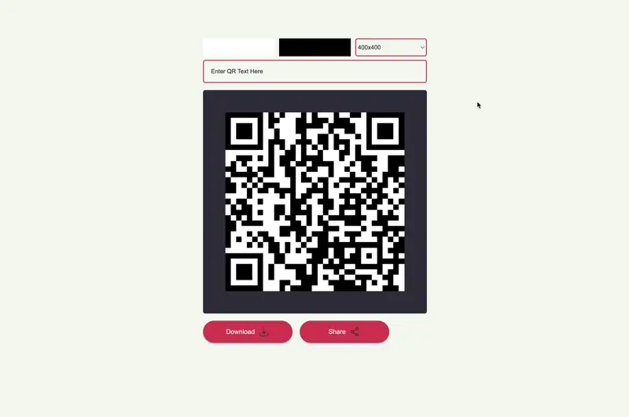

# QR Code Generator

## Description

This project is a web application that allows users to generate QR codes dynamically for various purposes. Users can input text, URLs, or other data, and the application will generate a corresponding QR code that can be scanned by compatible devices.

## Key Features

- **Dynamic QR Code Generation:** Users can input text or URLs, and the application generates QR codes instantly.
- **Customization Options:** Users can customize the size and colors of the QR codes.
- **Preview:** Provides a real-time preview of the generated QR code.
- **Download Option:** Allows users to download the generated QR code as an image file.
- **Share Option:** Allows users to share the generated QR code if browser supports it.

## Technologies Used

- **HTML5:** Provides the structure of the web page.
- **CSS3:** Handles the styling and layout of the user interface.
- **JavaScript:** Implements the logic for QR code generation and interactivity.
